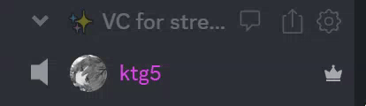

<h1 align="center">discord-xbox-party-theme <kbd>1.1.1</kbd></h1>

Discord but it's got Xbox 360 Live Party icons by people in VC...

## Screenshots.

  
  
Demo of the theme in VC.

## How to work.
1. [Download BetterDiscord](https://betterdiscord.app/)
2. Download [the theme (CSS)](https://raw.githubusercontent.com/ktg5/discord-xbox-party-theme/main/discord-xbox-party.theme.css)
3. Open up `User Settings` > `BetterDiscord` > `Themes`, and click `Open Themes Folders`.
4. Drag-and-drop [the theme](https://github.com/ktg5/discord-xbox-party-theme/discord-xbox-party.theme.css) into the folder that was just opened.
5. Enable the theme from the `Themes` page.
6. Hop into a VC and try it out!
